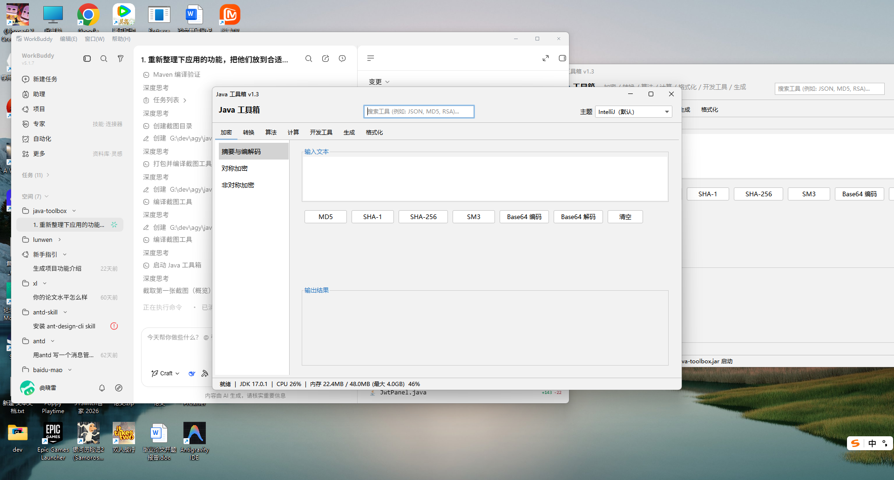

# Java 工具箱

> 桌面端多功能工具箱，基于 Java Swing + FlatLaf 外观包。JDK 8+ 即可运行，双击 `run.bat` 或 `java -jar java-toolbox.jar` 启动。

<p align="center">
  
</p>

## 功能一览

| 分组 | 工具 | 说明 |
|------|------|------|
| 加密 | 摘要与编解码 | MD5 / SHA-1 / SHA-256 / SM3 摘要与 Base64 编解码 |
| 加密 | 对称加密 | AES / DES / 3DES / SM4（支持 ECB/CBC 模式、PKCS5 填充、防乱码文本密钥生成） |
| 加密 | 非对称加密 | RSA / SM2（支持密钥对生成、公钥加密/私钥解密、私钥签名/公钥验签） |
| 转换 | 进制与编码 | 二/八/十/十六进制互转（二进制 4 位自动分组美化），UTF-8/GBK/URL 编码 |
| 转换 | 时间戳转换 | 秒/毫秒、自定义格式、时区 |
| 转换 | Base64 图片转换 | 图片文件与 Base64 字符串互转，支持比例自适应预览与本地保存 |
| 转换 | 格式转换 | JSON / XML / YAML / CSV / Properties 之间任意双向互相转换，完美支持嵌套与点分扁平化还原 |
| 算法 | 排序可视化 | 冒泡/选择/插入/快排/归并，逐帧动画 + 统计 |
| 算法 | 查找算法 | 二分查找（区间收缩过程）+ 线性查找 |
| 计算 | 科学计算器 | 表达式求值（Nashorn 优先，回退自实现双栈求值器） |
| 计算 | 统计计算 | 均值/中位数/方差/标准差/极差 |
| 格式化 | JSON 格式化 | 无依赖 JSON 美化/压缩状态机 |
| 格式化 | XML 格式化 | 无依赖 XML 美化（缩进 2 空格）与压缩，支持语法错误校验 |
| 格式化 | SQL 格式化 | 对常见 SQL 关键字大写美化、换行与缩进优化 |
| 开发工具 | 正则测试 | 实时匹配高亮、分组捕获、匹配计数 |
| 开发工具 | JWT 编解码 | 支持 Header/Payload 实时解析与过期状态提示，支持 HS256 签名生成 |
| 开发工具 | Cron 表达式解析 | 校验 Cron 表达式，并计算未来 5 次的预计执行时间 |
| 开发工具 | 文本对比 | 纯 Java 计算两端文本差异，并以彩色高亮显示结果（标记新增与删除行） |
| 开发工具 | Docker 转换 | 将 `docker run` 运行命令解析并一键转换为 `docker-compose` YAML 声明配置 |
| 开发工具 | 子网计算器 | 输入 IP/CIDR（如 `192.168.1.1/24`）计算网络地址、广播地址、掩码并展示二进制 |
| 开发工具 | 颜色转换 | HEX / RGB / HSL 互转，集成 **JColorChooser 调色板** 与 **一键复制** |
| 生成 | UUID 生成 | 批量生成、去横线、大写、一键复制 |
| 生成 | 密码生成器 | 基于 SecureRandom 的离线强密码生成与实时强度评估 |

## 主题与体验优化

- **主题系统**：基于 FlatLaf 外观包，内置 54 套现代主题实时切换（带平滑过渡动画），如 Material、GitHub Dark、Solarized、One Dark 等。
- **排版与渲染**：输入输出区域字体统一采用 **微软雅黑 (Microsoft YaHei)**，不仅在英文字符下完美避免了连字现象（如等号正常分立），同时解决了中文字符显示为问号或乱码的渲染痛点。
- **主题高度自适应**：全局优化所有主题下的组件高度表现，按钮、输入框、下拉选择框等高度均自适应且全局最低保持 32 像素，防止元素在某些精简主题下显得局促或被裁剪。

## 界面布局

```
┌──────────────────────────────────────────────────────┐
│  Java 工具箱  · 加密 / 转换 / 算法 / 计算 / 格式化 / 开发工具 / 生成  │
├──────────────────────────────────────────────────────┤
│ [加密][转换][算法][计算][格式化][开发工具][生成]     │
├──────────┬───────────────────────────────────────────┤
│ 工具列表  │                                           │
│ • 工具A  │           内容区（CardLayout）              │
│ • 工具B  │                                           │
│ • 工具C  │                                           │
└──────────┴───────────────────────────────────────────┘
```

## 运行

```bash
# 方式一：双击
run.bat

# 方式二：命令行启动
java -Dfile.encoding=UTF-8 -jar java-toolbox.jar
```

## 编译

```bash
mvn clean package -DskipTests
# 产物：target/java-toolbox.jar
```

## 技术栈

- Java Swing（GUI）
- FlatLaf 3.5.4（外观包 + IntelliJ 主题包）
- BouncyCastle 1.70（国密 SM2/SM3/SM4 算法支持，提供与经典加解密的统一调用）
- Maven Shade（打 fat jar）
- 纯 JDK 实现：JSON 美化、中缀表达式求值、标准 AES/DES/3DES/RSA 加解密

## 项目结构

```
src/main/java/com/aqishi/toolbox/
├── Main.java              # 启动入口
├── ui/
│   ├── MainFrame.java     # 主窗口：7 大页签 + 搜索 + 主题
│   ├── ToolPanel.java     # 工具面板抽象基类（含搜索关键词匹配）
│   └── ThemeManager.java  # FlatLaf 主题管理（54 套主题）
├── crypto/                # 加密
├── convert/               # 转换
├── algo/                  # 算法
├── calc/                  # 计算
├── misc/                  # 格式化 / 开发工具 / 生成
│   ├── JsonPanel.java     # JSON 格式化
│   ├── JsonFormatter.java # JSON 格式化状态机
│   ├── XmlPanel.java      # XML 格式化
│   ├── SqlPanel.java      # SQL 格式化
│   ├── RegexPanel.java    # 正则测试
│   ├── JwtPanel.java      # JWT 编解码
│   ├── CronPanel.java     # Cron 表达式
│   ├── TextDiffPanel.java # 文本对比
│   ├── DockerComposePanel.java # Docker 转换
│   ├── SubnetPanel.java   # 子网计算器
│   ├── ColorPanel.java    # 颜色转换
│   ├── UuidPanel.java     # UUID 生成
│   └── PasswordPanel.java # 密码生成器
└── util/UIUtils.java      # UI 辅助
```

## License

MIT
