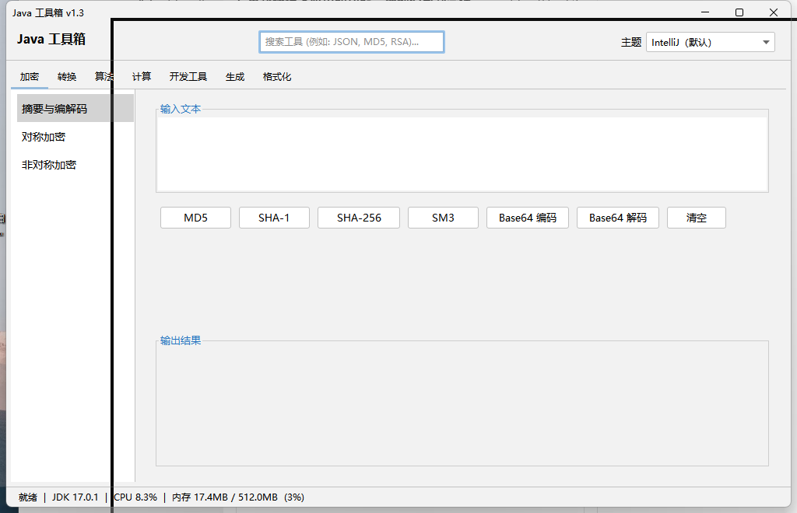

# Java 工具箱

> 桌面端多功能工具箱，基于 Java Swing + FlatLaf 外观包，运行要求 JDK 17+。双击 `run.bat` 或 `java -jar target/java-toolbox.jar` 启动。

架构重写说明见 [全量架构重写设计](docs/superpowers/specs/2026-08-16-full-architecture-rewrite-design.md)，新增能力规划见 [功能路线图](docs/feature-roadmap.md)。

<p align="center">
  
</p>

## 功能一览

| 分组 | 工具 | 说明 |
|------|------|------|
| 加密 | 摘要与编解码 | MD5 / SHA-1 / SHA-256 / SM3 摘要与 Base64 编解码 |
| 加密 | 对称加密 | AES / DES / 3DES / SM4（推荐 AES-GCM；支持 CBC，ECB 仅用于历史兼容，含 PKCS5 填充与文本密钥生成） |
| 加密 | 非对称加密 | RSA / SM2（支持密钥对生成、公钥加密/私钥解密、私钥签名/公钥验签） |
| 加密 | 文件批量摘要与签名 | 最多 4 文件受限并发的流式摘要、校验清单核对，以及文件数字签名与验签 |
| 加密 | CSR / PKCS#12 / 证书链检查 | 解析 CSR 并自验签、检查 PKCS#12 密钥库、诊断多级 X.509 证书链 |
| 转换 | 进制与编码 | 二/八/十/十六进制互转（二进制 4 位自动分组美化），UTF-8/GBK/URL 编码 |
| 转换 | 时间戳转换 | 秒/毫秒、自定义格式、时区 |
| 转换 | Base64 图片转换 | 图片文件与 Base64 字符串互转，支持比例自适应预览与本地保存 |
| 转换 | URL 编解码与参数解析 | 支持 URL 编解码，结构化拆解 Scheme/Host/Port/Path 及 Query 参数 Key-Value 表格解析与重组 |
| 转换 | 格式转换 | JSON / XML / YAML / TOML / INI / CSV / Properties 之间双向转换，支持嵌套结构与语法诊断 |
| 转换 | JSONPath 查询 | 基于 JSONPath 的字段提取、切片/过滤查询、路径列表模式与错误定位 |
| 算法 | 排序可视化 | 冒泡/选择/插入/快排/归并，逐帧动画 + 统计 |
| 算法 | 查找算法 | 二分查找（区间收缩过程）+ 线性查找 |
| 算法 | 汉诺塔 | 汉诺塔交互演示，支持手动拖盘与自动动画播放 |
| 算法 | 见缝插针 | AA 见缝插针游戏，支持多难度选择、关卡平滑正弦变速与自动通关解锁 |
| 计算 | 科学计算器 | 表达式求值（Nashorn 优先，回退自实现双栈求值器） |
| 计算 | 统计计算 | 均值/中位数/方差/标准差/极差 |
| 计算 | Linux 权限计算器 | 提供图形化 r/w/x 与 Special 位矩阵勾选，实时双向计算八进制/符号表示与 chmod 命令 |
| 格式化 | JSON 格式化 | 无依赖 JSON 美化/压缩/树形折叠预览，支持彩虹括号语法高亮 |
| 格式化 | XML 格式化 | 无依赖 XML 美化/压缩/树形折叠预览，支持标签属性语法着色与语法错误校验 |
| 格式化 | SQL 格式化 | 对常见 SQL 关键字大写美化、换行与缩进优化 |
| 开发工具 | 正则测试 | 实时匹配高亮、分组捕获、匹配计数 |
| 开发工具 | JWT 编解码 | 支持 Header/Payload 实时解析与过期状态提示，支持 HS256 签名生成与 Token 构造 |
| 开发工具 | Cron 表达式解析 | 校验 Cron 表达式，并计算未来 15 次的预计执行时间 |
| 开发工具 | 文本对比 | 纯 Java 计算两端文本差异，并以彩色高亮显示结果（标记新增与删除行） |
| 开发工具 | Docker 转换 | 将 `docker run` 运行命令解析并一键转换为 `docker-compose` YAML 声明配置 |
| 开发工具 | 子网计算器 | 输入 IP/CIDR（如 `192.168.1.1/24`）计算网络地址、广播地址、掩码并展示二进制 |
| 开发工具 | HTTP 接口测试 | 轻量 HTTP 客户端，支持 GET / POST / PUT / DELETE，自定义请求头、Body 与 Content-Type |
| 开发工具 | OpenAPI 工作台 | 导入 OpenAPI 3 / Swagger 2.0 规范，浏览端点、编辑参数、在线调试与导出 cURL |
| 开发工具 | 回调 Mock | 启动临时 HTTP 服务器接收回调请求，自定义响应状态码与内容，实时回显请求详情 |
| 开发工具 | 颜色转换 | HEX / RGB / HSL 互转，集成 **JColorChooser 调色板** 与 **一键复制** |
| 开发工具 | 证书管理 | X.509 证书管理：支持根证书创建、子证书签发、证书解析，以及 **ACME v2 免费证书自动申请**（支持 Let's Encrypt / ZeroSSL，集成 Cloudflare API 自动挂载/清理 TXT 记录、DNS-01/HTTP-01 验证、倒计时保护及一键打包 Zip 导出） |
| 开发工具 | K8s 部署生成 | Kubernetes 资源 YAML 生成器，支持 Deployment / Service / Ingress（含 TLS）/ ConfigMap 实时预览与导出 |
| 开发工具 | Redis 管理 | Redis 连接管理与键浏览器（列表/树形双视图），支持值编辑与命令控制台操作 |
| 开发工具 | 流程图与时序图设计 | 现代化流程图与时序图设计器，支持流程节点、生命线、激活条。支持多选拖动、节点修改文字、双击编辑、高阶撤销/重做（Ctrl+Z / Ctrl+Y）、中键/空白处拖拽画布滚动与 Ctrl+滚轮丝滑缩放，以及鼠标悬停节点控制点直接拖拽出连线吸附的极速连线交互，支持 PNG 导出 |
| 开发工具 | BPMN 流程图设计器 | 专业 BPMN 2.0 流程图绘制，支持事件/任务/网关节点、智能吸附连线、框选批量移动与一键自动拓扑排版 |
| 开发工具 | Mermaid 绘图 | Mermaid 语法实时预览与高清 PNG 渲染，支持拖拽平移、丰富图表模板与本地导出 |
| 开发工具 | 字符串工具 | 字符串实时长度与编码字节统计、字符/子串/正则替换与删除、一键大小写与命名驼峰转换 |
| 生成 | UUID 生成 | 批量生成、去横线、大写、一键复制 |
| 生成 | 密码生成器 | 基于 SecureRandom 的离线强密码生成与实时强度评估 |
| 生成 | 二维码工具 | 支持文本/URL 生成二维码（自定义颜色/尺寸/导出）、图片识别解码 |
| 生成 | 账号密码管理 | 与 TOTP 共用安全保险库和主密码，支持检索、增删改、隐藏与安全复制 |
| 生成 | 动态验证码 (TOTP) | 与密码管理共用锁定会话，支持密钥/链接导入、自适应账号展示与安全复制 |
| 生成 | 随机测试数据生成 | 批量生成模拟测试数据，包含百家姓姓名、手机号、电子邮箱、地址、身份证号与银行卡号 |
| 运维 | 数据库管理 | 多数据库管理客户端（支持 MySQL / PostgreSQL / Oracle / SQLite / H2 等），数据库树形浏览、SQL 执行与结果导出 |
| 运维 | Hosts 环境管理 | 系统 Hosts 文件管理，支持多套 Dev/QA/Staging 环境规则定义、一键开关应用与 DNS 缓存刷新 |
| 运维 | WebSocket 测试 | WebSocket / 长连接测试客户端，支持 ws/wss 握手请求头配置、消息收发与定时心跳包保活 |
| 监控 | 视频监控 | 视频监控面板，支持多路画面分屏布局、格子合并拆分与设备树管理 |
| 监控 | 远程桌面 | 纯 P2P 远程控制桌面，优先采用 ice4j 完整 ICE 状态机进行 UDP 双向打洞（多 STUN、triggered check、peer-reflexive candidate、角色冲突处理与候选对提名），失败后尝试带 UPnP/NAT-PMP 的 TCP 直连；不配置 TURN，信令服务器不转发桌面数据 |
| 运维 | Kafka 管理 | 管理 Kafka 集群，浏览主题与消费组，查看 Lag 详情，消息拉取/发布，以及**实时查看主题的订阅消费组与活跃成员分区分配** |
| 运维 | K8s 集群管理 | 多集群管理，Kubeconfig 导入与 Namespace 切换，浏览 Pod/Deployment/Service/ConfigMap/Node，日志追踪，Exec 容器终端，以及**容器文件上传与下载** |
| 其它 | 微信群发与通讯录 | 微信群发，以及自适应读取微信 SQLite 通讯录（展示昵称、备注、微信号、头像，支持 Excel 导出、一键追加群发、头像批量下载） |
| 其它 | 微信导出工具脚本 | `tools/wechat_export.py`：基于 Windows UIAutomation 的微信 UI 自动化导出工具，附带可视化悬浮控制面板（暂停/继续/停止）、自动重试与坐标防失焦校验 |

## 主题与体验优化

- **主题系统**：基于 FlatLaf 外观包动态发现并实时切换 IntelliJ 主题（主题数量随 FlatLaf 版本提供，带平滑过渡动画），如 Material、GitHub Dark、Solarized、One Dark 等。
- **排版与渲染**：输入输出区域字体统一采用 **微软雅黑 (Microsoft YaHei)**，不仅在英文字符下完美避免了连字现象（如等号正常分立），同时解决了中文字符显示为问号或乱码的渲染痛点。
- **主题高度自适应**：全局优化所有主题下的组件高度表现，按钮、输入框、下拉选择框等高度均自适应且全局最低保持 32 像素，防止元素在某些精简主题下显得局促或被裁剪。
- **流程图与时序图高阶画布交互**：
  - **撤销与重做**：配备完整历史快照栈，支持无限制的 `Ctrl+Z` 撤销与 `Ctrl+Y` 重做，保证编辑流程的安全。
  - **缩放与滚动**：支持 `Ctrl+鼠标滚轮` 的丝滑无缝画布缩放，支持鼠标中键按住或拖动空白处进行无限制的丝滑视口滚动，免除传统滚动条卡顿局限。
  - **极速连线**：无需切换连线工具，鼠标滑过任何图形时其四周将自动高亮 4/8 个连接锚点（Port），用户在小圆圈上直接按住并拖拽便能一气呵成地拖出新连线并实现智能吸附。
  - **几何边缘吸附**：针对椭圆、菱形、平行四边形、六边形等异形图形，引入了外轮廓边界射线投影算法。不管是从中点还是从顶角引出/指向的连线，端点都会自动贴合在其物理图形的真实几何边缘上，彻底杜绝了连线在空中悬空不挨着图形的视觉硬伤。
  - **文字即时编辑**：支持选中节点直接在属性面板进行文字修改，或双击节点直接触发编辑。

## 界面布局

```
┌──────────────侧边导航──────────────┬──────────────当前工具栏──────────────┐
│ Java 工具箱        [收起导航]       │ 加密安全 / 摘要与编解码  [主题][语言] │
│ [搜索全部工具……]                   ├─────────────────────────────────────┤
│ ▼ 加密安全                         │                                     │
│   摘要与编解码                     │                                     │
│   对称加密                         │           当前工具内容区             │
│   非对称加密                       │          惰性 CardLayout             │
│ ▶ 转换编码                         │                                     │
│ ▶ 开发调试                         │                                     │
├────────────────────────────────────┴─────────────────────────────────────┤
│ 就绪 | JDK | CPU | 内存                                                  │
└──────────────────────────────────────────────────────────────────────────┘
```

侧边导航支持拖动调宽、完全收起、分组展开状态记忆，以及 `Ctrl+K` 全局搜索。工具视图首次打开时构建，之后切换会保留输入内容和页面状态。

## 安全保险库

账号密码管理和 TOTP 使用同一个主密码、同一个加密保险库和同一个锁定状态。保险库采用 PBKDF2-HMAC-SHA256（600,000 次、随机盐）派生密钥，并以 AES-GCM 认证加密；保存时使用新 nonce、写后解密校验、加密备份和原子替换。

- 默认空闲 5 分钟自动锁定，可在保险库设置中选择 1、5、10 或 30 分钟，不能永久关闭。
- 复制密码或动态验证码后 30 秒自动清理剪贴板；如果期间复制了其它内容，不会清除新内容。
- Windows 数据位于 `%APPDATA%\JavaToolbox`；macOS 位于 `~/Library/Application Support/JavaToolbox`；Linux 分别遵循 `XDG_DATA_HOME` 和 `XDG_CONFIG_HOME`。
- 启动时会识别工作目录中的旧 `toolbox-passwords.enc` 和 `toolbox-config.properties`，先创建强加密备份并验证新保险库，再移除旧文件和明文 `totp.accounts`。
- 主密码无法恢复。忘记密码时只能从已知主密码的加密备份恢复，或移走保险库后创建新的空保险库。
- 主密码正确但无法打开时，先保留 `toolbox-vault.json.enc` 和 `backups` 目录，再检查目录权限、磁盘空间和是否有另一个应用实例占用锁。不要删除旧文件或备份来重试迁移。

恢复前请复制整个应用数据目录。另一个实例正在运行时，本实例只读，关闭其它实例后重新启动即可恢复写入。

## 运行

```bash
# 方式一：双击或直接执行
run.bat

# 方式二：命令行启动（指定最大堆内存和文件编码）
java -Xmx512m -Dfile.encoding=UTF-8 -jar .\target\java-toolbox.jar
```

## 编译

```bash
mvn clean package "-Dmaven.test.skip=true"
# 产物：target/java-toolbox.jar
```

## 开发

```bash
# 推送代码（本地已缓存 GitHub 凭据）
git push
```

基于 GitHub MCP 进行开发，提交后直接 `git push` 即可推送代码到远程。

## 技术栈

- Java Swing（GUI）
- FlatLaf 3.5.4（外观包 + IntelliJ 主题包）
- BouncyCastle 1.70（国密 SM2/SM3/SM4 算法支持，提供与经典加解密的统一调用）
- Jackson 2.15.2 + Tomlj 1.0.0（JSON/XML/YAML/TOML 数据模型与语法解析）
- ice4j 3.2（远程桌面完整 ICE/STUN UDP 直连；未启用 TURN）
- Maven Shade（打 fat jar）
- 本地实现与库协作：JSON 树视图/格式化、中缀表达式求值，以及标准 AES/DES/3DES/RSA 加解密

## 项目结构

```
src/main/java/com/aqishi/toolbox/
├── Main.java                         # 启动入口
├── catalog/                          # 稳定工具 ID、分类、描述与工厂注册表
│   ├── ToolCatalog.java
│   ├── ToolDescriptor.java
│   ├── ToolRegistry.java
│   └── ToolboxContext.java
├── ui/                               # Swing 壳层、导航和共享组件
│   ├── MainFrame.java
│   ├── ToolPanel.java
│   ├── ToolNavigationModel.java
│   ├── ToolNavigationState.java
│   ├── ToolSidebar.java
│   └── ToolContentHost.java
├── feature/                          # 按功能领域组织的 UI、应用服务和领域模型
│   ├── security/                     # 加密、证书、账号密码和 TOTP
│   ├── codec/                        # 编码、格式、文本和时间转换
│   ├── network/                      # HTTP、MQTT、WebSocket、SSH 和网络诊断
│   ├── data/                         # 数据库、Redis、Kafka、ZooKeeper
│   ├── cloud/                        # Docker/Kubernetes 工具与应用服务
│   ├── system/                       # Hosts、权限、Cron 和微信工具
│   ├── generation/                   # 数据、二维码和颜色生成/转换
│   ├── compute/                      # 计算器、统计、算法和游戏
│   ├── diagram/                      # BPMN、Mermaid、流程图与 DTO
│   └── monitor/                      # 视频监控、远程桌面与传输实现
├── domain/                            # 跨 feature/infra 共享的无依赖模型
├── infra/                            # 外部连接、配置持久化和生命周期适配器
│   ├── config/                        # JSON 偏好设置与配置存储
│   ├── database/                     # JDBC 连接与数据库配置存储
│   ├── kubernetes/                   # Kubernetes REST 与 kubeconfig
│   ├── kafka/                        # Kafka 管理客户端工厂
│   ├── redis/                        # Jedis 与 Redis 配置存储
│   ├── messaging/                    # Kafka/MQTT 资源生命周期
│   ├── network/                      # HTTP/WebSocket 资源生命周期
│   └── ssh/                          # JSch 会话生命周期
├── vault/                            # 加密保险库、迁移和剪贴板策略
└── util/                             # 国际化、配置和 UI 辅助

tools/wechat_export.py                # 唯一维护的微信 UIAutomation 脚本源
```
## Roadmap

`v1.9.0` 已交付 OpenAPI 工作台、JSONPath 查询、批量摘要与签名校验，以及 CSR/PKCS#12/证书链检查；当前迭代已扩展 YAML/TOML/INI 格式转换。下一阶段优先补齐 DNS/TLS/HTTP 诊断、日志查看过滤器和工作区导入导出；完整范围、依赖和分类见 [功能路线图](docs/feature-roadmap.md)。

## 详细功能文档
针对涉及复杂打洞、容器交互及UI自动化的工具，提供了专门的技术与使用指南文档：

- [文档索引](docs/INDEX.md)：路线图、优化清单、专题指南和设计/实施记录的入口。

- 📡 [远程桌面 (Remote Desktop) 技术与使用指南](docs/remote_desktop_guide.md)：包含 ICE/STUN 打洞机制、TCP 回退原理及自建信令服务器指导。
- ☸️ [K8s 集群管理 (K8s Manager) 指南](docs/k8s_manager_guide.md)：涵盖多集群配置导入、Web Terminal、日志流追踪与容器文件传输说明。
- 💬 [微信工具与 UI 自动化导出指南](docs/wechat_tools_guide.md)：说明本地通讯录解析及 Python UIAutomation 悬浮控制面板脚本的使用方法。

## 自动构建与发布

项目配置了 GitHub Actions 跨平台自动打包工作流（`.github/workflows/release.yml`）。

当为仓库推送版本标签（例如 `v1.9.0` 或 `vX.Y.Z`）时，GitHub Actions 会在 **Windows**、**macOS** 与 **Linux** 三端虚拟机上并行触发原生构建：
1. **自动原生打包 (jpackage)**：使用 JDK 17 与 `jpackage` 工具，裁剪出各平台专属的精简 Java 运行时（JRE），将应用与 JRE 打包为免安装原生可执行程序。
2. **多平台 Release 资产发布**：构建完成后将自动在 GitHub Releases 页面发布以下安装包与应用程序：
   - 🪟 **Windows 免安装原生包**：`java-toolbox-v*-windows.zip`（解压即可双击 `java-toolbox.exe` 运行，无需电脑安装 Java）
   - 🍏 **macOS 免安装原生包**：`java-toolbox-v*-macos.zip`（解压即可直接运行 `java-toolbox.app`）
   - 🐧 **Linux 免安装原生包**：`java-toolbox-v*-linux.tar.gz`（解压直接运行原生二进制程序）
   - ☕ **跨平台 Fat JAR**：`java-toolbox-v*.jar`（原纯 JAR 包，供习惯 `java -jar` 的开发者使用）

开发者触发自动构建发布的命令：
```bash
git tag vX.Y.Z
git push origin vX.Y.Z
```

此外，也可以在 GitHub 仓库的 **Actions** 标签页下手动选择 `Release Application` 工作流点击 **Run workflow** 触发跨平台构建。

## License

MIT
